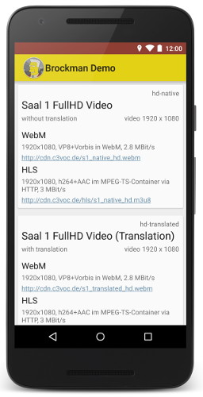

[](https://travis-ci.org/johnjohndoe/BrockmanDemo) [](http://choosealicense.com/licenses/apache-2.0/)

# Brockman demo

Android project to demonstrate the usage of the [Brockman library][brockman-library]




## Usage

There is an **app module** to checkout a working example.


### Gradle build

To install the demo application to your device run the following task:

```bash
$ ./gradlew installDebug
```


## Author

* [Tobias Preuss][tobias-preuss]

## License

    Copyright 2015 Tobias Preuss

    Licensed under the Apache License, Version 2.0 (the "License");
    you may not use this file except in compliance with the License.
    You may obtain a copy of the License at

       http://www.apache.org/licenses/LICENSE-2.0

    Unless required by applicable law or agreed to in writing, software
    distributed under the License is distributed on an "AS IS" BASIS,
    WITHOUT WARRANTIES OR CONDITIONS OF ANY KIND, either express or implied.
    See the License for the specific language governing permissions and
    limitations under the License.


[brockman-library]: https://github.com/johnjohndoe/Brockman
[tobias-preuss]: https://github.com/johnjohndoe
